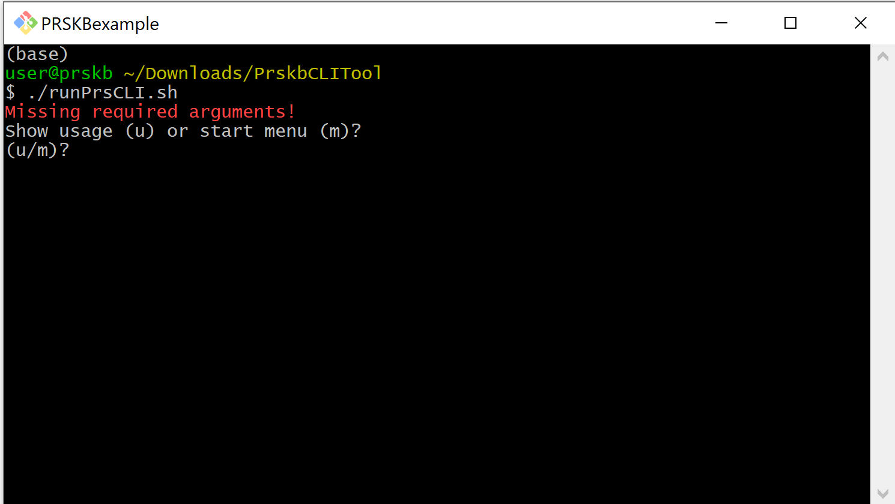
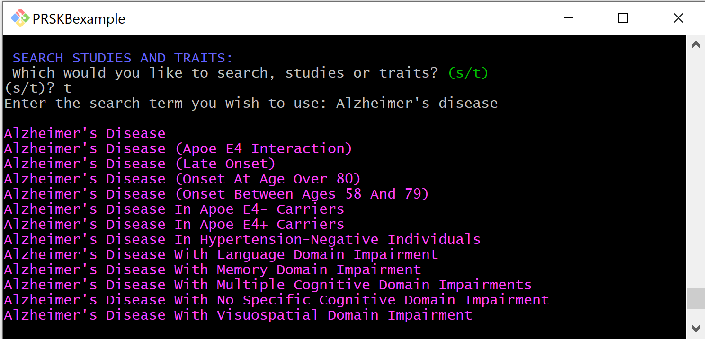
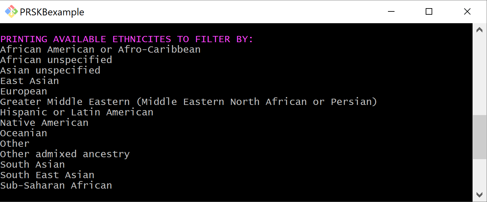
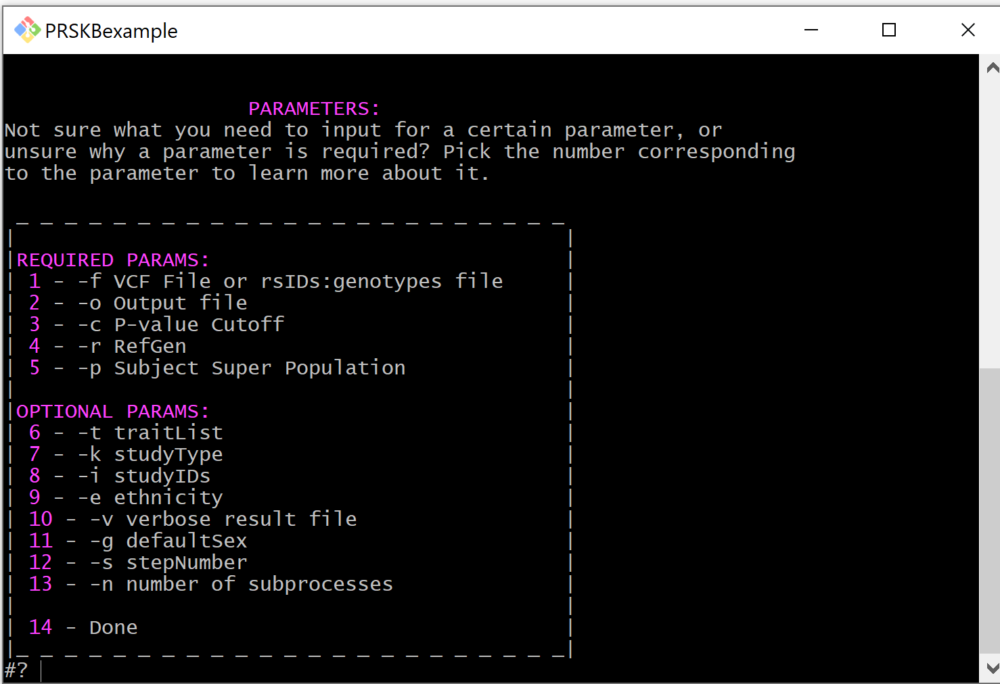

.. PRSKB CLI documentation master file, created by
   sphinx-quickstart on Fri Oct 23 23:04:05 2020.
   You can adapt this file completely to your liking, but it should at least
   contain the root `toctree` directive.

Welcome to PRSKB's CLI documentation!
=====================================

.. toctree::
   :maxdepth: 2
   :caption: Contents:

The PRSKB's CLI tool is an extension of the PRSKB web application. It is designed to give more flexability and capability in calculating polygenic risk scores for large datasets. Features include:

* Searching the database for studies and traits
* Printing out available ethnicities to filter by
* Learning about required and optional parameters for performing calculations
* Uploading GWA Study data to use for calculations
* Calculating polygenic risk scores

Quick Start
-----------

To download the PRSKB CLI tool, head over to the `PRSKB website download page <https://prs.byu.edu/cli_download.html>`_ or download the whole repository directly from `GitHub <https://github.com/kauwelab/PolyRiskScore>`_.

Given the required parameters, the tool will calculate risk scores for each individual sample for each study and trait combination in the database. 

*NOTE: You MUST have bash and jq for bash, and python3 and the PyVCF, filelock, and requests Python modules installed. For GWAS uploading, you must also have the myvariant, biopython, and biothings_client Python modules installed.*

Required Parameters Example
^^^^^^^^^^^^^^^^^^^^^^^^^^^

.. code-block:: bash

   ./runPrsCLI.sh -f path/to/file/samples.vcf -o path/to/file/output.tsv -c 0.05 -r hg19 -p EUR

Features
========

The CLI polygenic risk score calculator can be run directly from the command-line or through the CLI's interactive menu. The menu includes the options to search the database and to learn more about the parameters involved in risk score calculations. 
To access the menu, run the script without parameters. You will be given the option to see the usage statement or start the interactive menu. 

.. image:: ../../images/RunMenu.png
  :alt: CLI menu screen shot

Search the Database
----------------------

Through the interactive menu, users can search the database for traits or studies. This can be helpful when filtering studies to run the calculator on. 

After selecting the menu option to search for studies or traits, you will be prompted to specify if you are searching for studies or traits. You can then enter the search term you wish to use. 

When the search is complete, the results will be printed to the console, and you will be returned to the menu. 

Display Ethnicities
--------------------

The menu has an option for displaying the available ethnicities to filter studies by.

Learn about Parameters 
----------------------

The menu also has an option for learning about the parameters involved in filtering studies and calculating scores. 

Required Parameters
^^^^^^^^^^^^^^^^^^^

File Path (-f)
""""""""""""""
The path to the input file. Either a vcf or a txt with lines formatted as rsID:allele1,allele2. Additionally, can use Bash Expansion to specify vcf's broken up by chromosome. If using this option, be sure to enclose with either single (') or double (") quotes.

.. code-block:: bash

   -f path/to/file/samples.vcf
   -f "path/to/files/samples_chr*.vcf"

Output File (-o)
""""""""""""""""
The path to output file. Can be either a tsv or a json. 

.. code-block:: bash

   -o path/to/file/output.tsv

P-value Cutoff (-c)
"""""""""""""""""""
Creates a threshold for included snps.

.. code-block:: bash

   -c 0.0005

Reference Genome (-r)
"""""""""""""""""""""
The reference genome of samples in the input file. Available reference genomes: hg17, hg18, hg19, or hg38

.. code-block:: bash

   -r hg19

Super Population (-p)
"""""""""""""""""""""
The preferred super population to use for linkage-disequilibrium clumping. If a study has no super population attached to it or more than one super population, the tool will use this super population to determine which super population to use. These are the five super populations from the 1000 genomes project

* AFR - African
* AMR - American
* EAS - East Asian
* EUR - European
* SAS - South Asian

Below is the order in which super populations are selected based on the preferred super population. This is used in the case where a study has more than one super population associated with it, and the preferred super population is not one of the super populations associated with the study. 

* AFR - African --> AFR, AMR, SAS, EUR, EAS
* AMR - American --> AMR, EUR, SAS, EAS, AFR
* EAS - East Asian --> EAS, SAS, AMR, EUR, AFR
* EUR - European --> EUR, AMR, SAS, EAS, AFR
* SAS - South Asian --> SAS, EAS, AMR, EUR, AFR

.. code-block:: bash

   -p EUR

Optional Filtering Parameters
^^^^^^^^^^^^^^^^^^^^^^^^^^^^^

To run the PRSKB CLI calculator on a more specific set of studies, optional filtering parameters can be added. When specifying more than one, add the identifying flag in front of every filter specified. 

Traits (-t)
"""""""""""
Specific traits to run the calculator on. 

.. code-block:: bash

   -t "Alzheimer's Disease" -t acne

Study Types (-k)
""""""""""""""""
Specifies what kinds of studies to run analyses on. 

* HI (high impact) - studies that have the highest altmetric score within their trait group
* LC (largest cohort) - studies that have the largest sample size (initial and replication combined)
* O (other) - all other studies that do not fall in the first two categories

.. code-block:: bash

   -k HI -k LC

Study IDs (-i)
""""""""""""""
Specifies the studyID(s) of studies to run the calculator on.

.. code-block:: bash

   -i GCST004410

Ethnicity (-e)
""""""""""""""
Filters studies by the ethnicity of their sample population.

.. code-block:: bash

   -e European -e "East Asian"

Value Type (-y)
""""""""""""""""
Studies in our database can report either odds ratios or beta values for the associations. You can filter studies by the type of values they use.

.. code-block:: bash

   -y 'odds ratios'

Sex dependent associations (-g)
"""""""""""""""""""""""""""""""
Some studies have a sex associated with the reported associations. This parameter allows users to filter studies based on
sex. You can filter sex dependent studies by selecting either male (M), female (F), or exclude (E).

.. code-block:: bash

   -g f

Additonal Optional Parameters
^^^^^^^^^^^^^^^^^^^^^^^^^^^^^

These additional parameters manage calculation details and may only be specified once per calculation.

Verbose (-v)
""""""""""""
Creates a more detailed TSV result file. 
The verbose output file will include the following for each corresponding sample, study, and trait combination: 

* reported trait
* trait
* polygenic risk score
* protective variants
* risk variants
* variants that are present but do not include the risk allele
* variants that are in high linkage disequilibrium whose odds ratios are not included in the calculations

If the output file is in TSV format and this parameter is not included, the default TSV result
file will include the study ID and the corresponding polygenic risk scores for each sample.
If the output file is in JSON format, the results will, by default, be in verbose format.

*NOTE: There is no condensed version of JSON output.*

.. code-block:: bash

   -v

Step Number (-s)
""""""""""""""""
Breaks running the calculator into steps. Make sure when you are running the CLI in steps that the only parameter that changes between the two steps is the step parameter.

Step 1 deals with downloading data from the server for use in calculations. This step requires internet access.

Step 2 deals with the actual calculation of polygenic risk scores. This step does not require internet access but does need to have access to the files that were downloaded in step 1. 

.. code-block:: bash

   -s 1

Number Of Processes (-n)
""""""""""""""""""""""""

This parameter determines the number of subprocesses used by the Python multiprocessing module during the calculations. If no value is given by the user, all available cores will be utilized.

.. code-block:: bash

   -n 4

User GWAS upload file (-u)
""""""""""""""""""""""""""

This parameter allows the user to upload a GWAS summary statistics file to be used in polygenic risk score calculations instead of GWAS Catalog data stored in our database. The file must be tab separated, use a .tsv or .txt extension (or be a zipped file with one of those extensions), and have the correct columns in order for calculations to occur. (see Uploading GWAS Summary Statistics for more directions on uploading GWAS data)

.. code-block:: bash

   -u path/to/file/GWASsummaryStatistics.tsv

GWAS reference genome (-a)
""""""""""""""""""""""""""

Specifies the reference genome of the GWAS summary statistics data. If left off when a GWAS file is uploaded, the reference genome is assumed to be the same as the samples reference genome (-r).

.. code-block:: bash

   -a hg19

GWAS upload uses beta values (-b)
"""""""""""""""""""""""""""""""""

This flag indicates that the uploaded GWAS file uses beta values instead of odds ratios. (see Uploading GWAS Summary Statistics for more directions on uploading GWAS data) 

.. code-block:: bash

   -b

Minor allele frequency cohort (-q)
""""""""""""""""""""""""""""""""""

This parameter specifies the cohort to use for minor allele frequecies and the cohort to use for reporting percentile rank. The default is the Uk Biobank. Available options are:

* UKBB
* ADNI-AD
* ADNI-MCI
* ADNI-CN
* AFR
* AMR
* EAS
* EUR
* SAS

To use the minor allele frequencies from the user vcf, use -q user. Note that this option will not report percentile rank.

.. code-block:: bash

   -q adni-ad

Omit Percentiles (-m)
""""""""""""""""""""""""""""""""""

This flag prevents the calculation of percentile rank in the full output version. 

.. code-block:: bash

   -q adni-ad

Individual-specific LD clumping (-l)
""""""""""""""""""""""""""""""""""""

To perform linkage disequilibrium clumping on an individual level, include the -l parameter. By default, LD clumping is performed on a sample-wide basis, where the variants included in the clumping process are the same for each individual, based off of all the variants that are present in the GWA study. This type of LD clumping is beneficial because it allows for sample-wide PRS comparisons since each risk score is calculated using the same variants. In contrast, individual-wide LD clumping determines the variants to be used in the PRS calculation by only looking at the individual's variants that have a corresponding risk allele (or, in the absence of a risk allele, an imputed unknown allele) in the GWA study. The benefit to this type of LD clumping is that it allows for a greater number of risk alleles to be included in each individual's polygenic risk score.

.. code-block:: bash

   -l

Calculate Scores
----------------

Polygenic risk scores can be calculated directly through the command-line or through the interactive menu. Using just the required parameters, the CLI will calculate risk scores for all studies in the database for each individual in the input file. Additional parameters will filter studies to be included in the calculation. 

Uploading GWAS Summary Statistics
=================================

In addition to calculating polygenic risk scores using GWA studies from the GWAS Catalog stored in our database, users have the option to upload their own GWAS summary statistics to use in risk score calculations. 

Format
------

The GWAS summary statistics file to be uploaded **must** be in the correct format. It should be either a .tsv or a .txt tab separated file, or a zipped .tsv or .txt. The following columns are required and must be included in the file's header line: Study ID, Trait, RsID, Chromosome, Position, Risk Allele, Odds Ratio, and P-value. If the **-b** flag is present, then instead of an Odds Ratio column, the user should include a Beta Coefficient column and a Beta unit column. Additional optional columns that will be included if present are: P-value Annotation, Beta Annotation, Citation, and Reported Trait. Column order does not matter and there may be extra columns present in the file. Required and optional header names must be exact. Note that if P-value Annotation and/or Beta Annotation are present, then the calculator will separate calculations by those columns. If you do not wish for this to happen, do not include those optional columns.

If more than one odds ratio exists for an RsID in a study/trait combination, the program will notify the user and stop running. To avoid this, please ensure that you do not have any duplicated snps.

*NOTE: If a GWAS data file is specified, risk scores will only be calculated on that data. No association data from the PRSKB will be used. Additionally, the optional params -t, -k, -i, -e, -y, and -g will be ignored.*

Columns
-------

Below is a brief overview of the required and optional columns for uploading GWAS summary statistics data.

Required Columns
^^^^^^^^^^^^^^^^^^^

1. **Study ID** - A unique study identifier. In our database, we use GWAS Catalog study identifiers. As long as this is unique for each study, it can be whatever you want.
2. **Trait** - The Experimental Factor Ontology (EFO) trait the GWAS deals with.
3. **RsID** - The Reference SNP cluster ID (RsID) of the SNP.
4. **Chromosome** - The chromosome the SNP resides on.
5. **Position** - The position of the SNP in the reference genome.
6. **Risk Allele** - The allele that confers risk or protection.
7. **Odds Ratio** - Computed in the GWA study, a numerical value of the odds that those in the case group have the allele of interest over the odds that those in the control group have the allele of interest.
8. **Beta Coefficient** - Computed in the GWAS study, a numerical value that indicates the increase or decrease in the genetic risk per unit.
9. **Beta Unit** - The units associated with the beta coefficient. e.g. cm, beats per min.
10. **P-value** - The probability that the risk allele confers the amount of risk stated.

Optional Columns
^^^^^^^^^^^^^^^^^

1. **P-Value Annotation** - Provides additional information for the p-value, i.e. if the p-value computed only included women.
2. **Beta Annotation** - Provides additional information for the beta value.
3. **Citation** - The citation information for the study.
4. **Reported Trait** - Trait description for this study in the authors own words.

Examples
========

Run the calculator on all studies in the database:

.. code-block:: bash

   ./runPrsCLI.sh -f path/to/file/samples.vcf -o path/to/file/output.tsv -c 0.0005 -r hg19 -p SAS 

Run the calculator on all studies about the trait 'acne':

.. code-block:: bash

   ./runPrsCLI.sh -f path/to/file/samples.vcf -o path/to/file/output.tsv -c 0.0005 -r hg19 -p SAS -t acne 

Run the calculator on all high impact studies with samples that are of European descent:

.. code-block:: bash

   ./runPrsCLI.sh -f path/to/file/samples.vcf -o path/to/file/output.tsv -c 0.0005 -r hg19 -p AMR -k HI -e european 

Run the calculator on the study with study ID GCST004410:

.. code-block:: bash

   ./runPrsCLI.sh -f path/to/file/samples.vcf -o path/to/file/output.tsv -c 0.0005 -r hg19 -p EUR -i GCST004410 

Run the calculator on all studies in the database in two steps:

.. code-block:: bash

   ./runPrsCLI.sh -f path/to/file/samples.vcf -o path/to/file/output.tsv -c 0.0005 -r hg19 -p SAS -s 1 
   ./runPrsCLI.sh -f path/to/file/samples.vcf -o path/to/file/output.tsv -c 0.0005 -r hg19 -p SAS -s 2 

Run the calculator on all studies about the trait 'acne', filtering studies from the allAssociations_hg19_f.txt working file:

.. code-block:: bash

   ./runPrsCLI.sh -f path/to/file/samples.vcf -o path/to/file/output.tsv -c 0.0005 -r hg19 -p SAS
   ./runPrsCLI.sh -f path/to/file/samples.vcf -o path/to/file/output.tsv -c 0.0005 -r hg19 -p SAS -t acne -s 2 

Run the calculator using uploaded GWAS summary statistics:

.. code-block:: bash

   ./runPrsCLI.sh -f path/to/file/samples.vcf -o path/to/file/output.tsv -c 0.0005 -r hg19 -p AFR -u path/to/GWAS/GWASsummaryStatistics.tsv -a hg17
   ./runPrsCLI.sh -f path/to/file/samples.vcf -o path/to/file/output.tsv -c 0.0005 -r hg19 -p AFR -u path/to/GWAS/GWASsummaryStatistics.tsv

Run the calculator using uploaded GWAS summary statistics with beta values:

.. code-block:: bash

   ./runPrsCLI.sh -f path/to/file/samples.vcf -o path/to/file/output.tsv -c 0.0005 -r hg19 -p AFR -u path/to/GWAS/GWASsummaryStatistics.tsv -a hg17 -b
   ./runPrsCLI.sh -f path/to/file/samples.vcf -o path/to/file/output.tsv -c 0.0005 -r hg19 -p AFR -u path/to/GWAS/GWASsummaryStatistics.tsv -b

Run the calculator specifying the minor allele frequency cohort:

.. code-block:: bash

   ./runPrsCLI.sh -f path/to/file/samples.vcf -o path/to/file/output.tsv -c 0.0005 -r hg19 -p EAS -q adni-ad
   ./runPrsCLI.sh -f path/to/file/samples.vcf -o path/to/file/output.tsv -c 0.0005 -r hg19 -p EAS -q EAS

More examples can be found in the CLI download README.md

Output Results
==============

There are two choices for the tsv output results - condensed (default) or full. Additonally, you can choose to output results in JSON format, which contains all the information found in the 'full' format. Explanations of the columns found in the output are given below.

* **Study ID** -- The study identifier assigned by the GWAS Catalog (or the user if they uploaded their own GWAS summary statistics)
* **Reported Trait** -- Trait based on the phenotype being studied, as described by the authors
* **Trait** -- Trait assigned by the GWAS Catalog, standardized from the Experimental Factor Ontology
* **Citation** -- The citation of the study
* **P-Value Annotation** -- Additional information about the p-values
* **Beta Annotation** -- Additional information about the beta values
* **Score Type** -- This indicates if the study used odds ratios or beta values
* **Units (if applicable)** -- This column will contain the beta units if the Score Type is beta. 
* **SNP Overlap** -- Details the number of SNPs that are in the sample vcf/txt file which are in the study and not excluded from the calculation (see below)
* **SNPs Excluded Due To Cutoffs** -- Details the number of snps excluded from the study calculation due to p-value cutoff or minor allele frequency threshold
* **Included SNPs** -- The total number of SNPs included in the calculation
* **Used Super Population** -- The super population used for linkage disequillibrium

#### Columns Only Available In The Full Version
* **Percentile** -- Indicates the percentile rank of the samples polygenic risk score
* **Protective Variants** -- Variants that are protective against the phenotype of interest
* **Risk Variants** -- Variants that add risk for the phenotype of interest
* **Variants Without Risk Alleles** -- Variants that are present in the study, but the sample does not possess the allele reported with association. Note that a SNP may be in this list and also in the Protective Variants or Risk Variants list. This is caused by an individual being heterozygous for the alleles at that point. 
* **Variants in High LD** -- Variants that are not used in the calculation, due to them being in high linkage disequillibrium with another variant in the study. 

Condensed
---------

This version of the output results contains one row for each study with columns for each sample's polygenic risk score. 

Study ID | Reported Trait | Trait | Citation | P-Value Annotation | Beta Annotation | Score Type | Units (if applicable) | SNP Overlap | SNPs Excluded Due To Cutoffs | Included SNPs | Used Super Population | Sample1 | Sample2 | Sample3 | ect.

.. code-block:: bash

   ./runPrsCLI.sh -f path/to/file/samples.vcf -o path/to/file/output.tsv -c 0.0005 -r hg19 -p SAS

Full
----

This version of the output results contains one row for each sample/study pair. It also includes columns listing the rsIDs of the snps involved in the risk score calculation. 

Sample | Study ID | Reported Trait | Trait | Citation | P-Value Annotation | Beta Annotation | Score Type | Units (if applicable) | SNP Overlap | SNPs Excluded Due To Cutoffs | Included SNPs | Used Super Population | Polygenic Risk Score | Protective Variants | Risk Variants | Variants Without Risk Allele | Variants in High LD

.. code-block:: bash

   ./runPrsCLI.sh -f path/to/file/samples.vcf -o path/to/file/output.tsv -c 0.0005 -r hg19 -p SAS -v

Json
----

This version outputs the results in a json object format. The output automatically contains all the data the full version does and there is no condensed version of the json output. The file will contain a list of json study objects. Each study object will contain the list of samples and their score. 

.. code-block:: bash
    # example output
    [
        {
            "studyID": "GCST001",
            "reportedTrait": "Alzheimer's Disease",
            "trait": "Alzheimer Disease",
            "citation": "First Author et al. 2021",
            "pValueAnnotation": "NA",
            "betaAnnotation": "NA",
            "scoreType": "OR",
            "units (if applicable)": "NA",
            "snpOverlap": 8,
            "excludedSnps": 3,
            "includedSnps": 14,
            "usedSuperPop": "EUR",
            "samples": [
                {
                    "sample": "SAMP001",
                    "polygenicRiskScore": "1.277",
                    "protectiveAlleles": "rs1|rs2|rs3",
                    "riskAlleles": "rs4|rs5|rs6|rs7|rs8",
                    "variantsWithoutRiskAllele": "rs9|rs10|rs11|rs14",
                    "variantsInHighLD": "rs12|rs13"
                },
                {
                    "sample": "SAMP002",
                    "polygenicRiskScore": "NF",
                    "protectiveAlleles": "",
                    "riskAlleles": "",
                    "variantsWithoutRiskAllele": "rs1|rs2|rs3|rs4|rs5|rs6|rs7|rs8|rs9|rs10|rs11|rs14",
                    "variantsInHighLD": "rs12|rs13"
                },
                {
                    "sample": "SAMP003",
                    "polygenicRiskScore": "1.63",
                    "protectiveAlleles": "rs1|rs2|rs3",
                    "riskAlleles": "rs4|rs5|rs6|rs7|rs8",
                    "variantsWithoutRiskAllele": "rs1|rs2|rs3|rs4|rs5|rs6|rs7|rs8|rs9|rs10|rs11|rs14",
                    "variantsInHighLD": "rs12|rs13"
                }
            ]
        }
    ]

.. code-block:: bash

   ./runPrsCLI.sh -f path/to/file/samples.vcf -o path/to/file/output.json -c 0.0005 -r hg19 -p SAS

